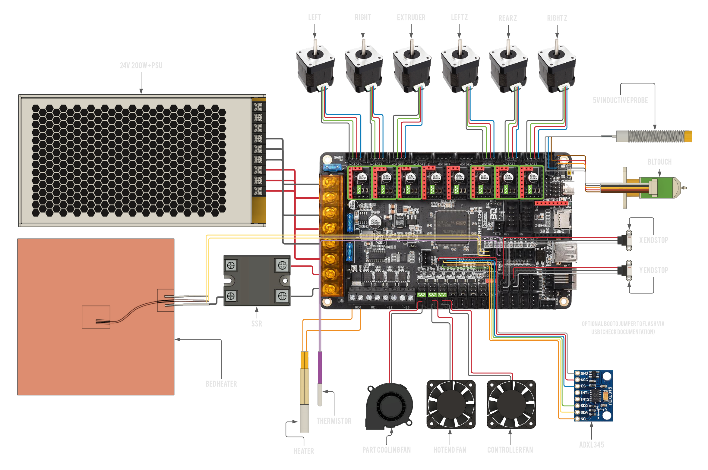

# Big Tree Tech Octopus Pro STM32F429

!> This board is **NOT** recommended, as it cannot be flashed automatically through USB, that means all firmware updates have to be done by manually moving an SD card back and forth. The Octopus Pro 446 is recommended instead.

## Wiring

!> If you use the Ratrig endstop switches and cables, do **not** blindly plug them in to your Octopus Pro 429 as doing this will short the board's 5V supply rail. You will probably have to swap the outer two wires (red and white) on the board end of the cable but double check this.

## Firmware installation

!> Make sure your board is connected to the Pi **via the provided USB-C cable** (USB-C on the Octopus Pro 429, USB-A on the Pi).

Move the `firmware-octopus-pro-429.bin` file from the release page (or from the `firmware_binaries` folder in mainsail) to the SD card that goes into your control board and call it `firmware.bin`, then insert the SD card in to the control board and power it on.

?>
You can verify if the board flashed correctly by checking if the firmware.bin file has been changed to firmware.CUR on the SD card. If you have trouble flashing the motherboard, start unplugging your wires beginning with the endstops, sometimes faulty wiring can cause the board to not boot properly.

?> Once you have verifed the board has been succesfully flashed, **DO NOT** reinsert the SD card. If you do, the automatic firmware updates won't work.

If you're going through initial setup please continue in the [installation guide](installation.md#setup)

## Manual firmware upgrade

Sometimes klipper makes changes to the microcontroller code and thus your MCU need to be reflashed with new firmware.

!> RatOS V1.0-RC3 automatically compiles new firmware for your board when klipper is updated and places it in the firmware_binaries folder, you can download the binary from here and flash via SD card manually.

### SD Card

Everytime klipper is updated, the firmware for the connected board is compiled and put into the `firmware-binaries` folder which you can find under the "Machine" tab. The process for this is the same as in the [Firmware Installation](#firmware-installation) step. Download the firmware file from Mainsail and put that onto an SD card (renaming it to firmware.bin) and insert it into your board, then power it on.

?>
You can verify if the board flashed correctly by checking if the firmware.bin file has been changed to firmware.CUR on the SD card. If you have trouble flashing the motherboard, start unplugging your wires beginning with the endstops, sometimes faulty wiring can cause the board to not boot properly.

?> Once you have verifed the board has been succesfully flashed, you don't have to reinsert the SD card.

## I updated klipper and now i get an error!

When you update klipper you might see an error that looks like this:

This is because klipper made changes to a part of the MCU firmware that we use. Klipper is telling us that the version of klipper running on the Pi is newer than the version running on the MCU. To fix this, we have to flash the board with a new version of the firmware. For convenience, and ease of use, the newest firmware is compiled and put in the firmware_binaries folder which you can find in the `MACHINE` tab in Mainsail. You can use this to flash your MCU the same way you did initially, via SD Card.
