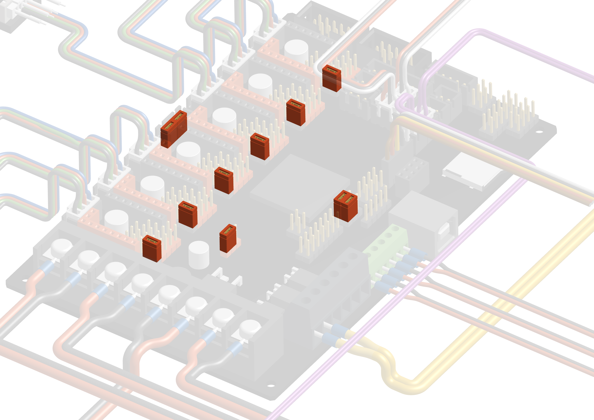

# Big Tree Tech SKR Pro V1.2

## Jumper configuration

## Stepper Pins

?> To use physical endstops on the SKR Pro you need to cut the diag pins from your X and Y stepper drivers. This will prevent you from using sensorless homing. If you later change your mind, you can swap X and Y with 2 of the Z steppers.

## Wiring

## Zoomed view of VIN

## Zoomed view of endstops and probes

?> There is an option to use an inductive probe, in that case the bl-touch pins can be used as shown. 6V - 36V probes will require custom wiring - do not plug more than 5V into the signal pin on the board.

## ADXL345

?> In Klipper you can use an ADXL345 accelerometer chip to automatically tune your Input Shaper settings. This works out of the box in RatOS if you wire it to the SPI port on the far right side of the SKR Pro 1.2.

## Firmware installation

Move the `firmware-skr-pro-12.bin` file from the release page to the SD card that goes into your control board and call it `firmware.bin`, then insert the SD card in to the control board and power cycle the board.

!> It is **IMPORTANT** that you leave the SD card in there, for automatic firmware updates to work with the SKR Pro 1.2

## Compiling and flashing the newest firmware via USB

!> Requires an SD card in your SKR Pro 1.2.

!> RatOS V1.0-RC3 automatically flashes the newest firmware to your
SKR Pro 1.2 when klipper is updated (if the klipper firmware has previously been flashed and an SD card is installed).
The steps below are only necessary if that fails and you get a klipper version mismatch error, and the firmware binary from the `firmware_binaries` folder in the Machine tab of mainsail does not work.

To compile and flash the newest firmware to the board, you need to SSH into the pi using something like PuTTy or `ssh pi@RatOS.local` via the commandline on OS X and Linux machines. Execute `~/klipper_config/config/boards/btt-skr-pro-12/make-and-flash-mcu.sh` and the Pi will compile the klipper firmware and flash the board for you.
