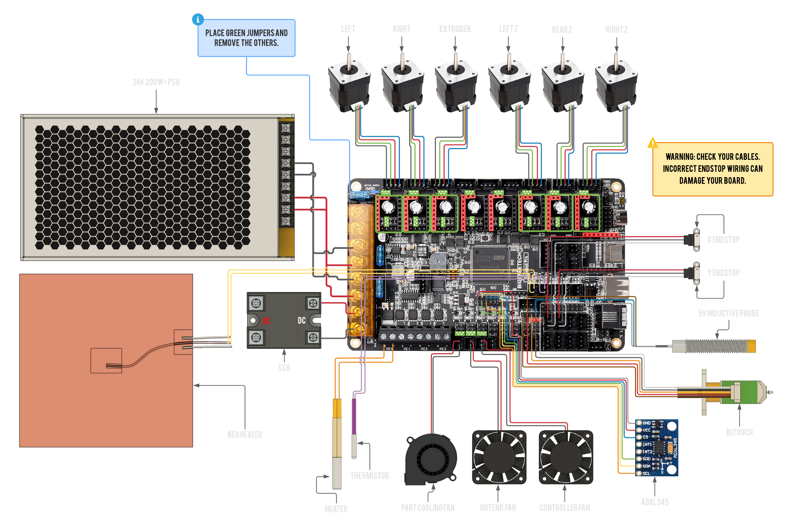

# BIGTREETECH Octopus Pro STM32F446

## Wiring

:::danger if you use the Ratrig endstop switches and cables, do **not** blindly plug them in to your Octopus as doing this will short the board's 5V power rail.
You will probably have to swap the outer two wires (red and white) on the board end of the cable but double check to make sure.
:::

:::info Jumpers
 A green square with triangles inside is where you would place a jumper,
remove all jumpers on the board that are not marked by this symbol.
:::

## Firmware installation

:::caution Use a proper cable
Make sure your board is connected to the Pi **via the provided USB-C cable** (USB-C on the Octopus, USB-A on the Pi).
:::

Download the `firmware-btt-octopus-pro-446.bin` from the `firmware_binaries` folder found on the Machine page of [Mainsail](http://RatOS.local/), copy it onto the SD card that goes into your control board and call it `firmware.bin`, then insert the SD card in to the control board. Here are the steps in chronological order:

1.  Navigate to [http://RatOS.local/](http://RatOS.local/)
2.  Open Machine page
3.  Open `firmware_binaries` folder
4.  Download `firmware-btt-octopus-pro-446.bin`
5.  Format the sd card for your board to FAT16 (sometimes just called FAT), or FAT32 with a clustersize of 8kb or 4kb.
6.  Copy `firmware-btt-octopus-pro-446.bin` onto the sd card for your board
7.  Rename `firmware-btt-octopus-pro-446.bin` to `firmware.bin`
8.  Safely eject the SD card through your operating system.
9.  Physically take out the sd card and insert it into your control board.
10. Power cycle your printer or control board. Remember to shut the pi down properly before you cut power to your Pi (you can do that through Mainsail using the dropdown menu in the top right corner).
11. Verify that the firmware has been flashed and **do not leave the sd card in the board after successful flashing**

:::tip
You can verify if the board flashed correctly by checking if the firmware.bin file has been changed to firmware.CUR on the SD card. If you have trouble flashing the motherboard, start unplugging your wires beginning with the endstops, sometimes faulty wiring can cause the board to not boot properly.
:::

:::danger Do not leave the SD card in the board
Once you have verifed the board has been succesfully flashed, **do not** reinsert the SD card. If the SD card remains in the board, the automatic flashing will not work.
:::

If you're going through initial setup please continue in the [installation guide](installation.md#setup)

## Manual firmware upgrade

Sometimes klipper makes changes to the microcontroller code and thus your MCU need to be reflashed with new firmware. You can do that in 2 ways.

:::info Automatic firmware updates
RatOS automatically flashes the newest firmware to your
Octopus Pro 446 when klipper is updated (if the klipper firmware has previously been flashed).
You shouldn't need any of the steps below unless that fails.
:::

### SD Card

If you're not used to the command line or haven't used SSH before, the easiest way is to download the firmware file from Mainsail and put that onto an SD card (renaming it to firmware.bin). Everytime klipper is updated, the firmware for the connected board is compiled and put into the `firmware-binaries` folder which you can find under the "Machine" tab. The process for this is the same as in the [Firmware Installation](#firmware-installation) step.

:::tip
You can verify if the board flashed correctly by checking if the firmware.bin file has been changed to firmware.CUR on the SD card. If you have trouble flashing the motherboard, start unplugging your wires beginning with the endstops, sometimes faulty wiring can cause the board to not boot properly.
:::

:::danger Do not leave the SD card in the board
Once you have verifed the board has been succesfully flashed, **do not** reinsert the SD card. If the SD card remains in the board, the automatic flashing will not work.
:::

### Flashing via USB

Another option is to SSH into the pi using something like PuTTy or `ssh pi@RatOS.local` via the commandline on OS X and Linux machines. Execute `sudo ~/klipper_config/config/boards/btt-octopus-pro-446/make-and-flash-mcu.sh` and the Pi will compile the klipper firmware and flash the board for you.

:::caution
Be sure to remove the SD card from the board before attempting to flash, if one is in there.
:::
