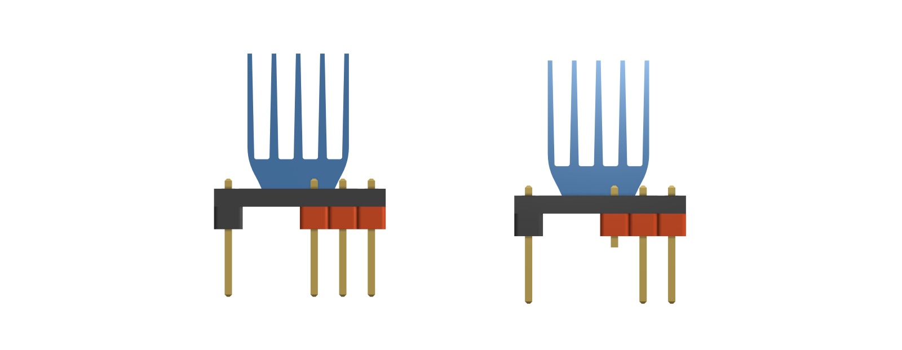
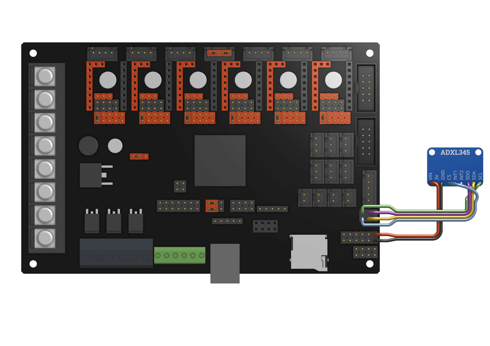
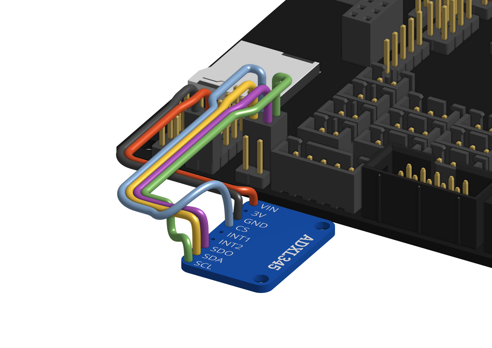

# BIGTREETECH SKR Pro v1.2

## Jumper configuration

## Stepper Pins

:::info
To use physical endstops on the SKR Pro you need to cut the diag pins from your X and Y stepper drivers. This will prevent you from using sensorless homing. If you later change your mind, you can swap X and Y with 2 of the Z steppers.

:::

## Wiring

:::danger if you use the Ratrig endstop switches and cables, do **not** blindly plug them in to your Octopus as doing this will short the board's 3.3V power rail.
You will probably have to swap the outer two wires (red and white) on the board end of the cable but double check to make sure.
:::

## Zoomed view of VIN

## Zoomed view of endstops and probes

:::info Inductive Probes
You can optionally use an inductive probe, in that case the BLTouch header can be used as shown below. 6V - 36V probes will require custom wiring - do not plug more than 5V into the signal pin on the board.
:::

## ADXL345

:::info
In Klipper you can use an ADXL345 accelerometer chip to automatically tune your Input Shaper settings. This works out of the box in RatOS if you wire it to the SPI port on the far right side of the SKR Pro 1.2.
:::

## Firmware installation

Move the `firmware-skr-pro-12.bin` file from the release page to the SD card that goes into your control board and call it `firmware.bin`, then insert the SD card in to the control board and power cycle the board.

:::tip
You can verify if the board flashed correctly by checking if the firmware.bin file has been changed to firmware.CUR on the SD card. If you have trouble flashing your control board, start unplugging your wires beginning with the endstops, sometimes faulty wiring can cause the board to not boot properly.
:::

:::danger Make sure to leave the card in the board
It is **IMPORTANT** that you leave the SD card in the board for automatic firmware updates to work with the SKR Pro 1.2
:::

## Compiling and flashing the newest firmware via USB

:::caution
Requires that klipper firmware is already flashed, and that an SD card is inserted into your SKR Pro 1.2.
:::

:::tip
RatOS automatically flashes the newest firmware to your
SKR Pro 1.2 when klipper is updated (if the klipper firmware has previously been flashed and an SD card is installed).
The steps below are only necessary if that fails and you get a klipper version mismatch error, and the firmware binary from the `firmware_binaries` folder in the Machine tab of mainsail does not work.
:::

To compile and flash the newest firmware to the board, you need to SSH into the pi using something like PuTTy or `ssh pi@RatOS.local` via the commandline on OS X and Linux machines. Execute `sudo ~/klipper_config/config/boards/btt-skr-pro-12/make-and-flash-mcu.sh` and the Pi will compile the klipper firmware and flash the board for you.
